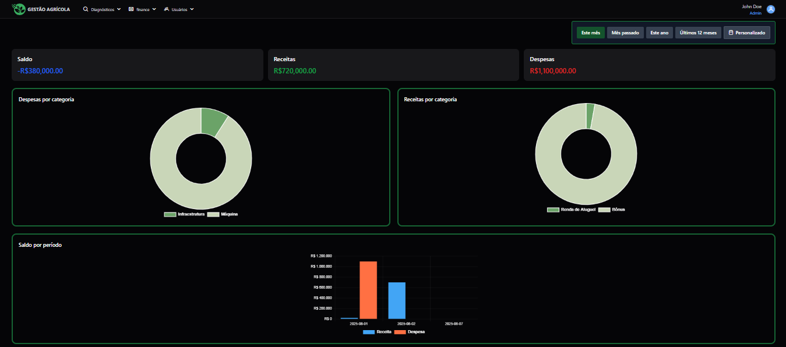
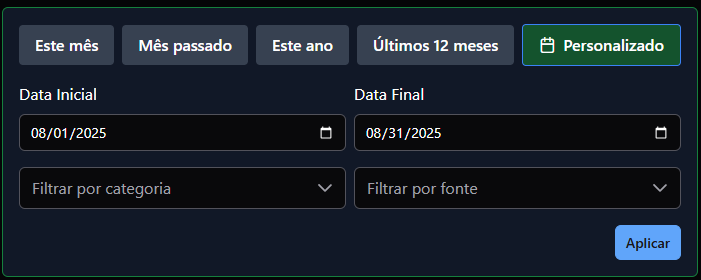
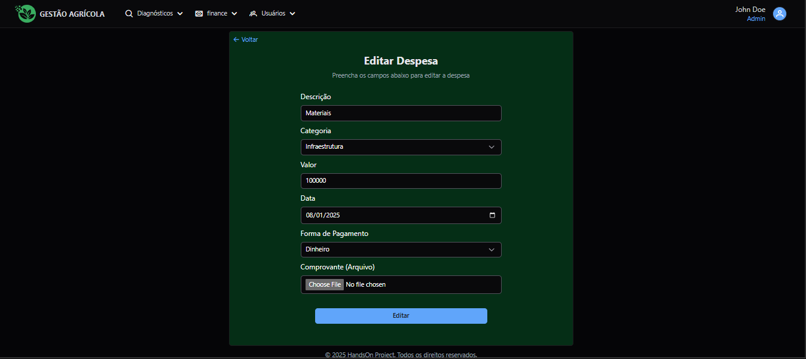
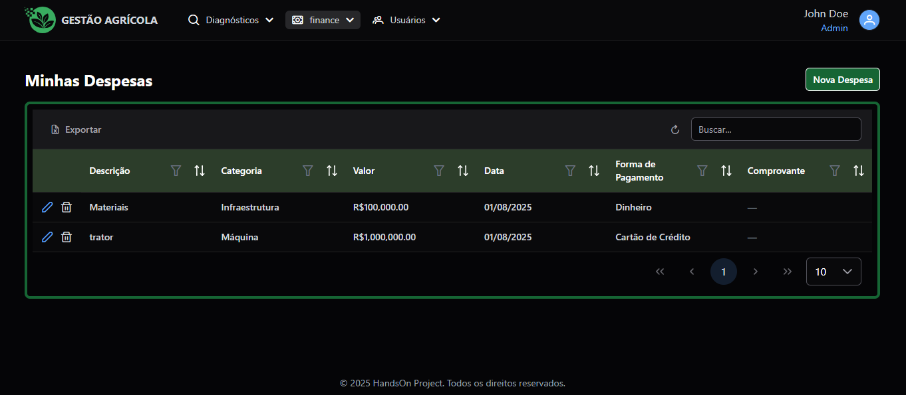

# Telas
## Dashboard

## Filter

## Form

## List


# HandsOn - Project Setup

This project uses **.NET 9** for the back-end and **Angular with Nx** for the front-end. Below are the detailed instructions to set up and run the development environment.

---

## 📌 Requirements

Before starting, install the following dependencies on your system:

### 🚀 Front-End

- [Node.js 20+](https://nodejs.org/en/download) (**Tested with: v22.14.0**)
- [Nx CLI](https://nx.dev/) (Install globally):
  ```sh
  npm add --global nx@latest
  ```

### 🛠️ Back-End

- [.NET 9](https://dotnet.microsoft.com/en-us/download)
- [Entity Framework Core](https://learn.microsoft.com/en-us/ef/core/get-started/overview/install) - Install globally after .NET:
  ```sh
  dotnet tool install --global dotnet-ef
  ```
- [MySQL](https://dev.mysql.com/downloads/mysql/) (**Tested with: v9.2**)
- A SQL database management tool, such as:
  - [DBeaver](https://dbeaver.io/)
  - [HeidiSQL](https://www.heidisql.com/)
  - [MySQL Workbench](https://www.mysql.com/products/workbench/)


# ⚙️ How to Run the Project

After installing all the requirements, follow the instructions to run the back-end and front-end.

## 📥 Cloning the Repository

To download the project, run the following command in the desired directory:

```sh
  git clone https://chinet@dev.azure.com/chinet/HandsOn/_git/HandsOn
```

🔹 **Important:** Make sure to execute this command in the folder where you want to store the code.

## 🏠 Back-End

### 1 - Configure Environment Variables

- Navigate to the back-end root folder:
  ```sh
  cd HandsOn-Back
  ```
- Open the configuration file:
  ```
  HandsOn-Back/src/API/appsettings.Development.json
  ```
- Edit the database connection details to match your MySQL credentials:
  ```json
  {
    "Logging": {
      "LogLevel": {
        "Default": "Information",
        "Microsoft.AspNetCore": "Warning"
      }
    },
    "AllowedHosts": "*",
    "ConnectionStrings": {
      "DefaultConnection": "server=localhost;port=3306;database=handson;user=root;password=root"
    },
    "Jwt": {
      "Key": "uNNtAoquY3kUMt1BsvLcUqf51rovyv2e",
      "ExpirationInMinutes": 1440,
      "Issuer": "http://localhost:4200",
      "Audience": "http://localhost:4200"
    },
    "Google": {
      "ClientId": "your-client-id",
      "ClientSecret": "your-client-secret"
    },
    "Hash": {
      "Key": "H9FfKD9B4pBl5U5KefxPfWcdB8Z6Vc8JCHQ2IzOgQxI="
    }
  }
  ```

### 2 - Restore Dependencies

Run the following command to download the required packages:

```sh
  dotnet restore
```

### 4 - Run the API

- **Via Terminal:**
  ```sh
  dotnet run --project "./src/API/API.csproj"
  ```
- **Or using VS Code:**
  - Open the project in VS Code.
  - Ensure the **startup project** is set to:
    ```
    ./src/API/API.csproj
    ```
  - Use the **debugger** to start the application.

👉 The API will be available at: `http://localhost:5143`

### 📏 Accessing Swagger

After starting the API, you can access the Swagger documentation in your browser at:

🔗 **http://localhost:5143**

Swagger allows you to test endpoints and view API documentation interactively.

---

## 🎨 Front-End

### 1 - Configure Environment Variables

- Navigate to the front-end root folder:
  ```sh
  cd HandsOn
  ```
- Locate the environment file:
  ```
  HandsOn/src/app/environments/environment.prod.json
  ```
- Copy and rename it to `environment.json`:
  ```sh
  cp HandsOn/src/app/environments/environment.prod.json HandsOn/src/app/environments/environment.json
  ```
- Edit the `environment.json` file and update the API URL to point to the back-end:

  ```json
  {
    "production": false,
    "clientId": "",
    "redirectUri": "",
    "jwtToken": "uNNtAoquY3kUMt1BsvLcUqf51rovyv2e",
    "allowedDomains": ["http://localhost:4200"],
    "authApiUrl": "http://localhost:5143/api/users",
    "usersApiUrl": "http://localhost:5143/api/users"
  }
  ```

### 2 - Install Dependencies

Run the following command in the front-end root directory to install the required packages:

```sh
npm install
```

### 3 - Run the Front-End

Start the Angular server:

```sh
npm run start
```

👉 The front-end will be available at: `http://localhost:4200/`.

## 🏆 Usage

To use the application, go to the login page at `http://localhost:4200/sign-in` and use one of the users created during the database seeding process.

- example1@gmail.com / test123 (Role: Admin)
- example2@gmail.com / test123 (Role: Owner)
- example3@gmail.com / test123 (Role: Consultant)
- example4@gmail.com / test123 (Role: Manager)
- example5@gmail.com / test123 (Role: Collaborator)

